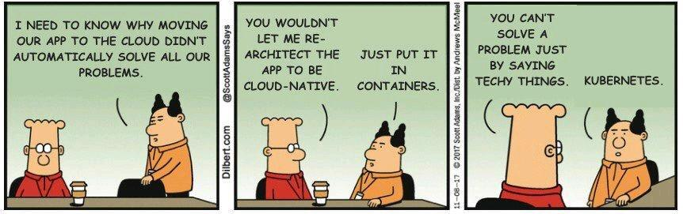

# [K3S - Lightweight Kubernetes](https://github.com/k3s-io/k3s/)



## Motivation

I just needed a local Kubernetes cluster to play with. It is going to be used
for experiments, so there must be a way to set it up and tear it down with
a single command. After abandoning the [original idea][k3s-sandbox-legacy]
I switched to Docker Compose based approach, which seems to be working much
simpler and faster.

## Usage

### Prerequisites

Download and install:

- [Docker](https://www.docker.com/) and [Docker Compose](https://docs.docker.com/compose/), or any other tool which understands `compose.yaml` files
- [kubectl](https://kubernetes.io/docs/tasks/tools/)
- [helm](https://helm.sh/docs/intro/install/)

### From nothing to running cluster

It's as simple as calling:
```
docker compose up -d
```
and after few seconds, if nothing explodes, `kubectls` config can be fetched with:
```
docker compose cp k3s-node-0:/etc/rancher/k3s/k3s.yaml ~/.kube/config
```

### Show me the dashboard

```
kubectl port-forward svc/portainer -n portainer 9000:9000 --address='0.0.0.0'
```

### Notes for future me

See: https://docs.k3s.io/advanced#running-k3s-in-docker

[k3s-sandbox-legacy]: https://github.com/tinylinden/k3s-sandbox