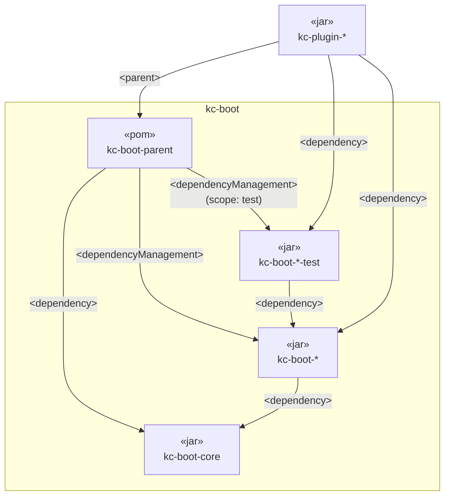

# Kafka Connect Like a Pro*

```mermaid
flowchart TB
  subgraph kc_boot[kc-boot]
    kc_boot_parent[&laquo;pom&raquo;\nkc-boot-parent]
    kc_boot_core[&laquo;jar&raquo;\nkc-boot-core]
    kc_boot_module[&laquo;jar&raquo;\nkc-boot-*]
    kc_boot_module_test[&laquo;jar&raquo;\nkc-boot-*-test]
  end
  kc_plugin[&laquo;jar&raquo;\nkc-plugin-*]

kc_boot_parent -- &lt;dependency&gt; --> kc_boot_core
kc_boot_parent -- &lt;dependencyManagement&gt; --> kc_boot_module
kc_boot_parent -- &lt;dependencyManagement&gt;\n(scope: test) --> kc_boot_module_test
kc_boot_module_test -- &lt;dependency&gt; --> kc_boot_module
kc_boot_module -- &lt;dependency&gt; --> kc_boot_core

kc_plugin -- &lt;parent&gt; --> kc_boot_parent
kc_plugin -- &lt;dependency&gt; --> kc_boot_module
kc_plugin -- &lt;dependency&gt; --> kc_boot_module_test
```
